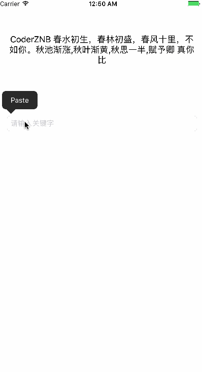

# ZNBKeyWordsHighted
关键字高亮显示
> 已经封装成继承系统的属性字符串 ``ZNBAttributedString``
```
/**
*  设置在一个文本中所有特殊字符的特殊颜色
*  @pragma  allStr      所有字符串
*  @pragma  specifiStr  特殊字符
*  @pragma  color       默认特殊字符颜色    红色
*  @pragma  font        默认字体           systemFont 17.号字
**/
+ (NSMutableAttributedString *)setAllText:(NSString *)allStr andKeyWords:(NSString *)keyWords withKeyWordsColor:(UIColor *)color KeyWordsFont:(UIFont *)font;

```

> 目前来说匹配程度还是有待商量的,希望大牛们指正

